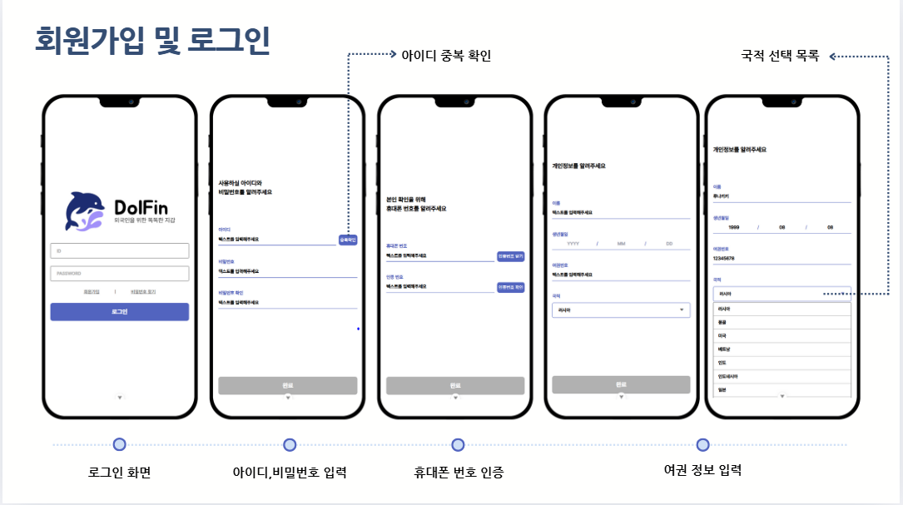
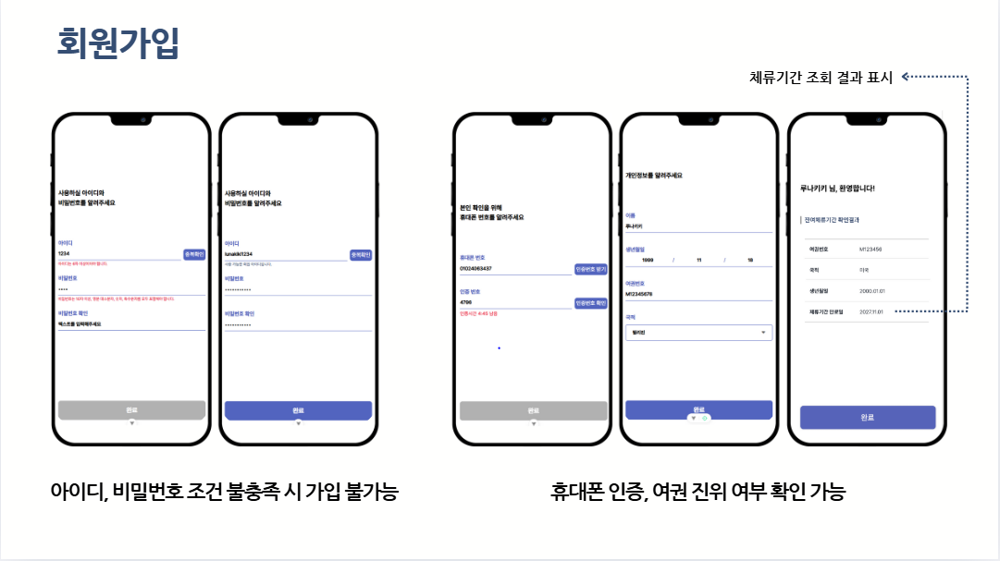
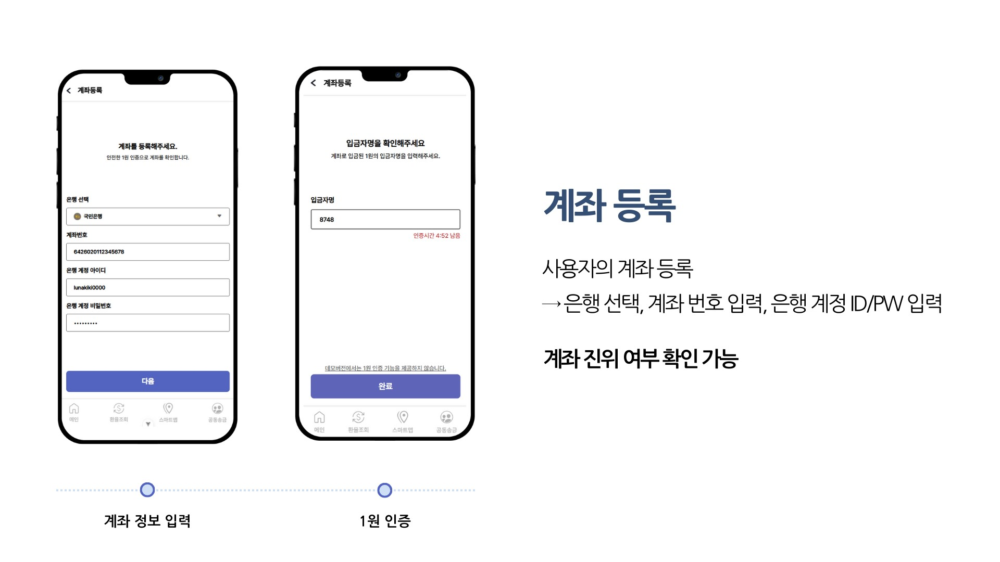
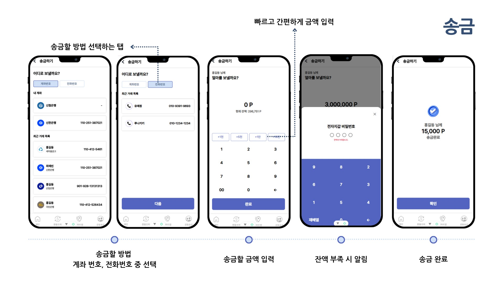
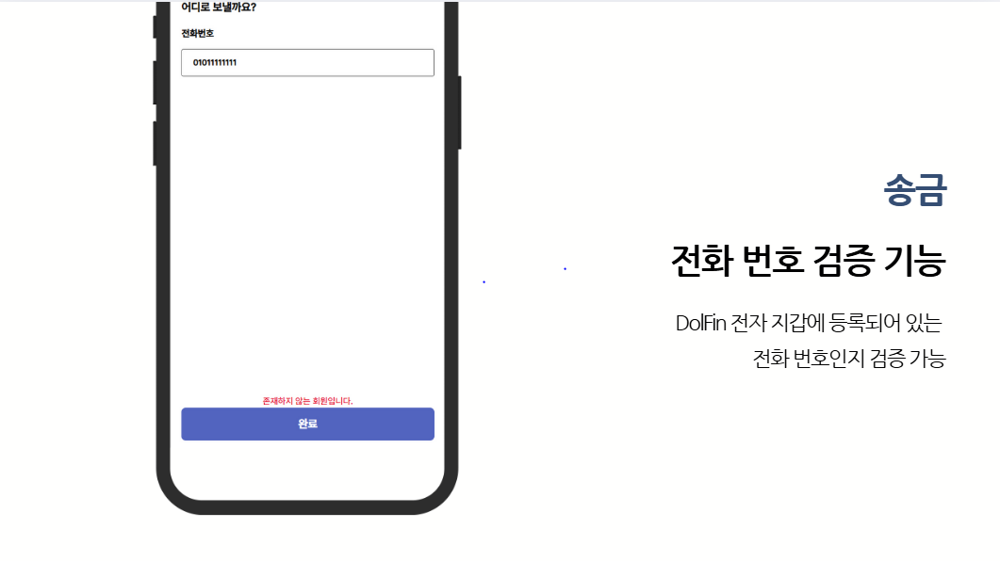

## 📝 목차 (Table of Contents)

- [1. 프로젝트 소개](#1-프로젝트-소개-)
- [2. 팀원 구성](#2-팀원-구성)
- [3. 개발 기간](#3-개발-기간)
- [4. 기술 스택 🚀](#4-기술-스택-)
- [5. 주요 기능 (Features)](#5-주요-기능-features-)
- [6. ERD](#6-erd)

---

## 1. 프로젝트 소개 📄
“외국인 전자 지갑 서비스”
 
외국인 유학생, 근로자, 다문화가정’을 대상으로,
언어·금융 소외 해소를 위한 디지털 금융 플랫폼

--- 
 

## 2. 팀원 구성
|               이준범(팀장)               |                 최예빈                 | 박준아 | 김호진 | 유예원 |
|:-----------------------------------:|:-----------------------------------:| :---: | :---: | :---: |
|  |  |  |  |  |
|            PM & Back End            |        Front End & Docs Lead        | Back End & git | Back End | Front End & UI/UX |

## 3. 개발 기간

 

## 4. 기술 스택 🚀
프론트 vue
 
백엔드 spring

 

## 5. 주요 기능 (Features) 🔎
여기에 주요 기능 내용을 작성합니다.

### 온보딩

- 회원 가입 하기 전 볼 수 있는 첫 화면, DolFin에 대한 간단한 설명

---
#### 회원가입

- 회원가입 및 로그인 절차 입니다
- 아이디, 비밀번호 입력, 휴대폰 번호 인증 후 여권 정보 입력

- 아이디,비밀번호 조건 불총족 시 가입 불가능
- 휴대폰 인증, 여권 정보를 입력하면 여권 진위 여부 확인 가능
- 여권의 진위 여부를 확인하며, 체류기간 조회 결과 표시

---

### 계좌등록

- 사용자의 계좌 등록 하는 페이지
- 실제 은행 선택, 계좌 번호 입력, 은행 계정 ID/PW 입력해서
- 1원 인증으로 계좌 진우ㅢ 여부 확인 가능

---

### 충전

- 전자지갑에 등록되어 있는 계좌를 통해 전자지갑 잔액을 충전
- 최소 금액 제한 : 1000원 으로 금액을 충전 가능

---

### 송금

- 송금 방법은 계좌 번호, 전화 번호를 선택해서 상대방에게 송금
- 내 계좌 표시 - 빠르게 내 계좌 선택 가능
- 최근 거래 목록 - 최근에 거래한 계좌 or 전화번호 표시

### 오송금 방지

- DolFin 전자 지갑에 등록되어 있어야 보내기 가능
- 등록되어 있는 전화 번호인지 검증 가능
 

## 6. erd

