# 외국인 전자지갑 서비스 DolFin

## 📝 목차

- [프로젝트 소개](#-프로젝트-소개)
- [팀원 구성](#-팀원-구성)
- [개발 기간](#-개발-기간)
- [주요 기능](#-주요-기능)
- [ERD](#-erd)
- [시스템 아키텍처](#-시스템-아키텍처)

## 📄 프로젝트 소개
외국인 전자 지갑 서비스 "DolFin"
 
외국인 유학생, 근로자, 다문화가정’을 대상으로,
언어·금융 소외 해소를 위한 디지털 금융 플랫폼

## 👨‍👩‍👧‍👦 팀원 구성
|               이준범(팀장)               |                 최예빈                 |                 박준아                 |                 김호진                 |                 유예원                 |
|:-----------------------------------:|:-----------------------------------:|:-----------------------------------:|:-----------------------------------:|:-----------------------------------:|
|  |  |  |  |  |
| **PM & Back End** | **Front End & Docs Lead** | **Back End & git Lead** | **Back End & Info Manage** | **Front End & UI/UX Lead** |

## 📅 개발 기간
### 2025.07.09 ~ 2025.08.19

|        단계        | 주요 내용                                 |           기간            |
|:----------------:|:--------------------------------------|:-----------------------:|
|      **기획**      | 프로젝트 주제 선정, 기능 명세서 작성                 | 2025.07.09 ~ 2025.07.15 |
|      **설계**      | 와이어프레임, 아키텍처, DB, API 명세서 설계 및 디자인 적용 | 2025.07.16 ~ 2025.07.22 |
| **프로젝트 세팅 및 개발** | 서버 환경 구축 및 CI/CD, 공용 컴포넌트 개발          | 2025.07.16 ~ 2025.08.07 |
|   **기초 기능 개발**   | 상품 크롤링 및 송금 핵심 기능 개발                  | 2025.08.01 ~ 2025.08.07  |
|   **핵심 기능 개발**   | 거래내역 조회 및 상품 조회 기능 개발                 | 2025.08.08 ~ 2025.08.15  |
| **테스트 및 성능 최적화** | 주요기능 및 성능 테스트                         | 2025.08.16 ~ 2025.08.19 |

## 🔎 주요 기능
#### 시연 영상 링크: https://youtu.be/a3l5aJi-Jxg?si=30Z51e6xPTT5O2hw

### 🌐다국어 UI 제공
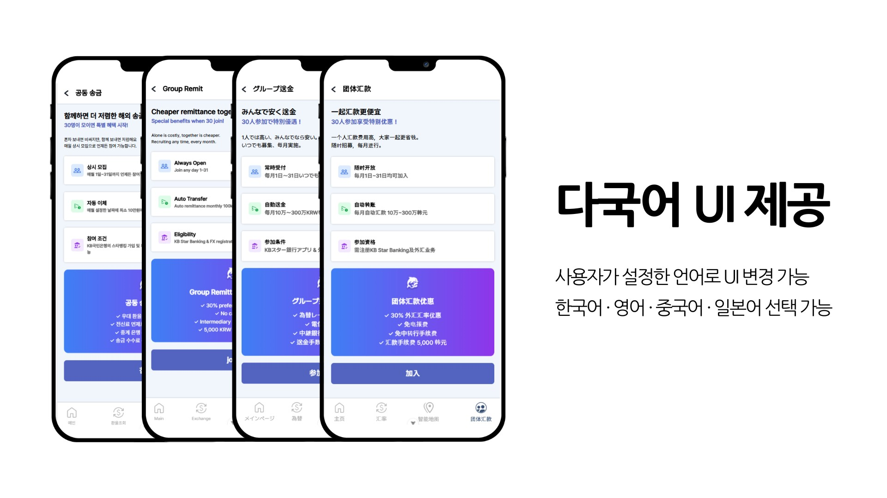
- 사용자가 설정한 언어로 UI 변경 가능

---

### 📝온보딩
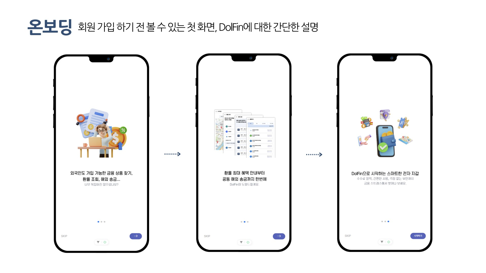
- 회원 가입 하기 전 볼 수 있는 첫 화면
- DolFin 서비스와 주요 기능을 간단히 소개
---

### 👤회원가입 & 로그인
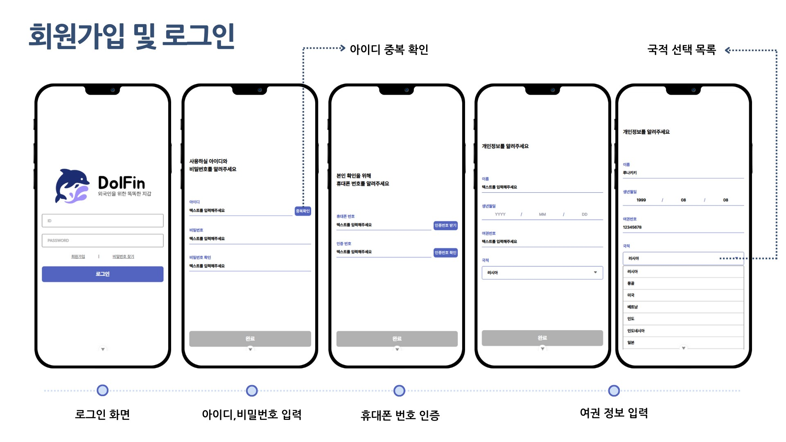
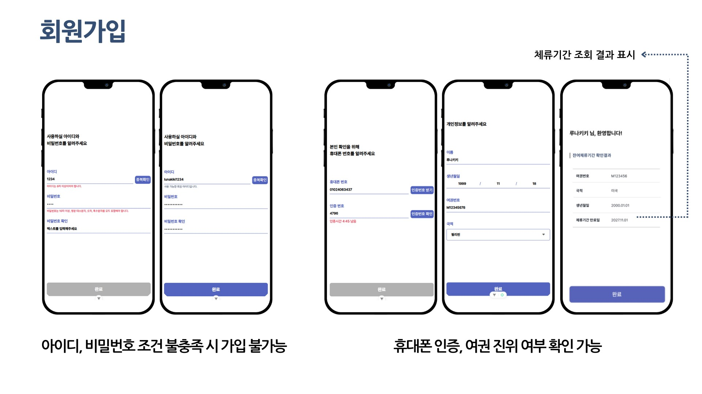
- 아이디/비밀번호, 휴대폰 인증, 여권 정보 입력
- 여권 진위 여부와 체류기간 확인
- 아이디, 비밀번호 조건 불총족 시 가입 불가능
---

### 🏦계좌등록
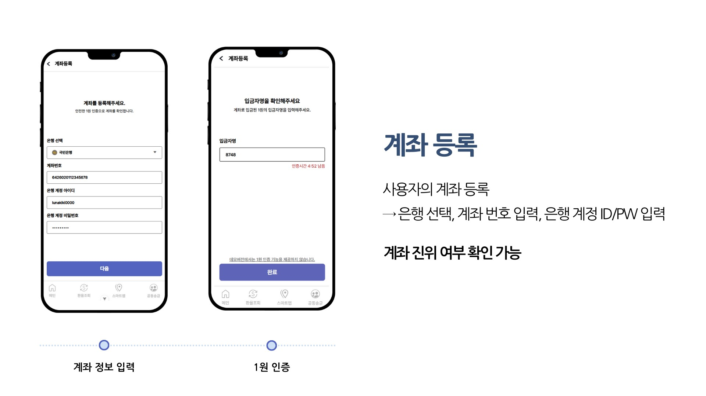
- 실제 은행 선택 후 계좌 등록
- 1원 인증으로 계좌 진위 여부 확인
---

### 💳충전
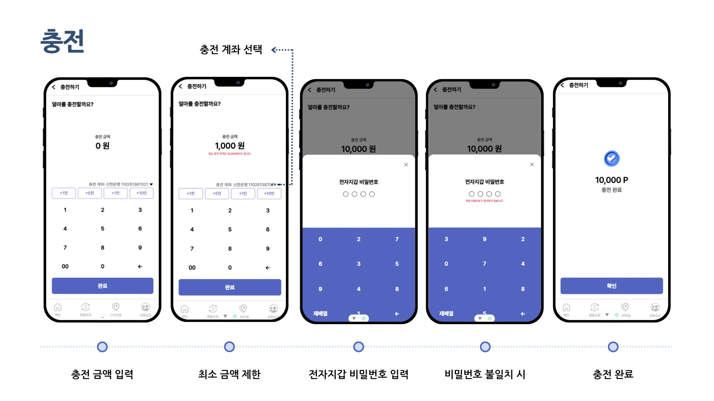
- 등록된 계좌에서 전자지갑으로 충전 
- 최소 충전 금액 : 10,000원
---

### 💸송금
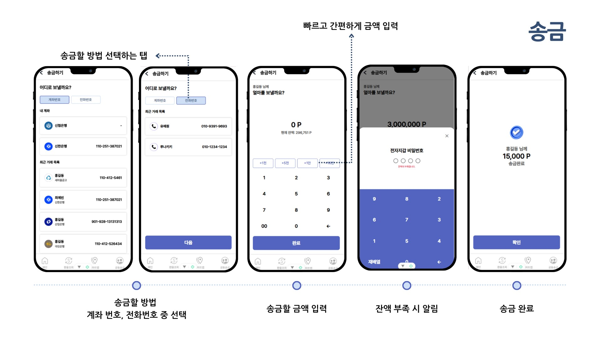
- 계좌번호 또는 전화번호로 송금 가능
- 최근 거래 내역 & 내 계좌 바로 선택
- 오송금 방지 : 등록된 사용자만 송금 가능
--- 

### 🤝공동송금
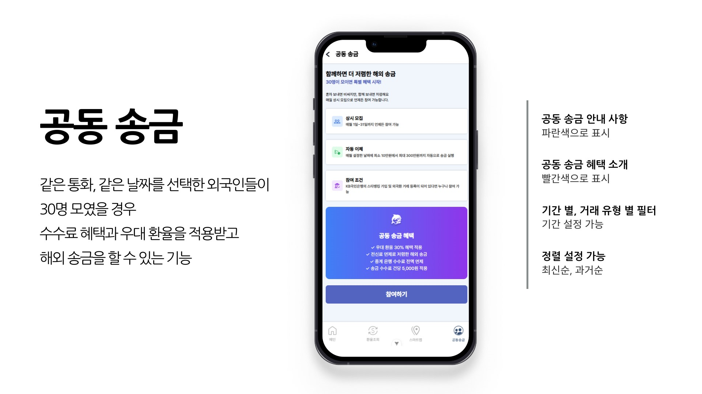
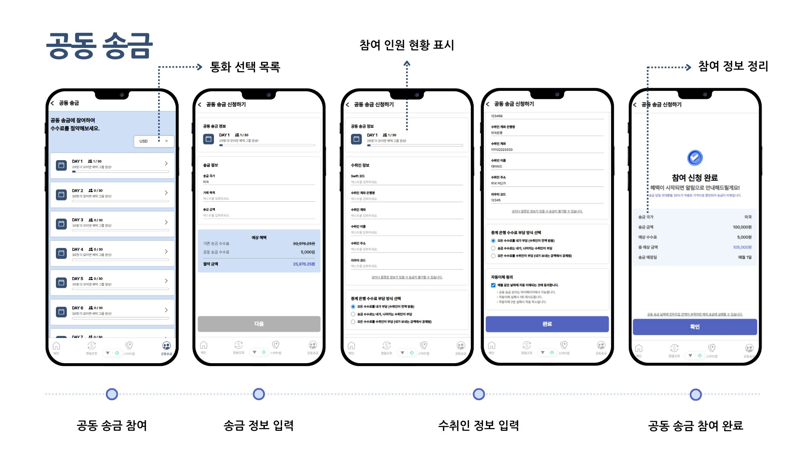
- 같은 조건의 외국인 30명이 모이면
  - 실제 수수료 혜택 & 우대 환율 제공 받아 송금 가능
- 송금 2회 이상 실패 시 자동 탈퇴
- 인원 부족 시 자동 충원, 30명 모집 완료 시 알림 전송
--- 

### 🎯상품 추천
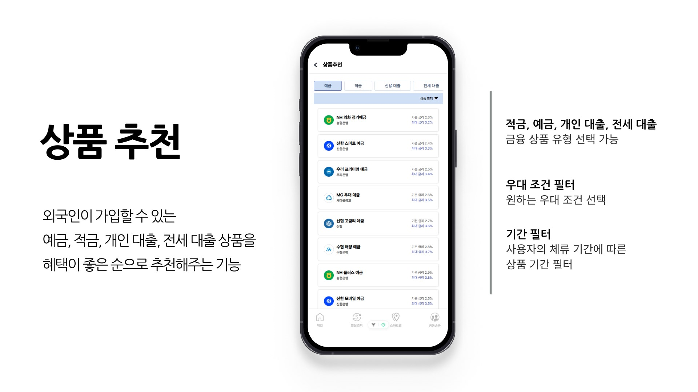
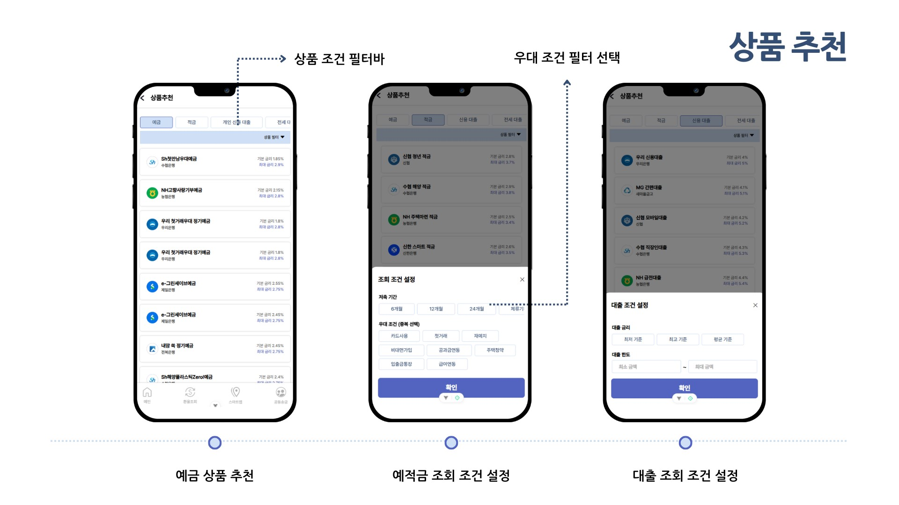
- 외국인이 가입할 수 있는 예금,적금,대출 상품을 혜택이 좋은 순으로 추천해주는 기능
- 원하는 우대 조건 선택
- 사용자의 체류기간 기반 상품 필터링
- 은행 정보 & 가장 가까운 지점 안내
---

### 💱환율 조회
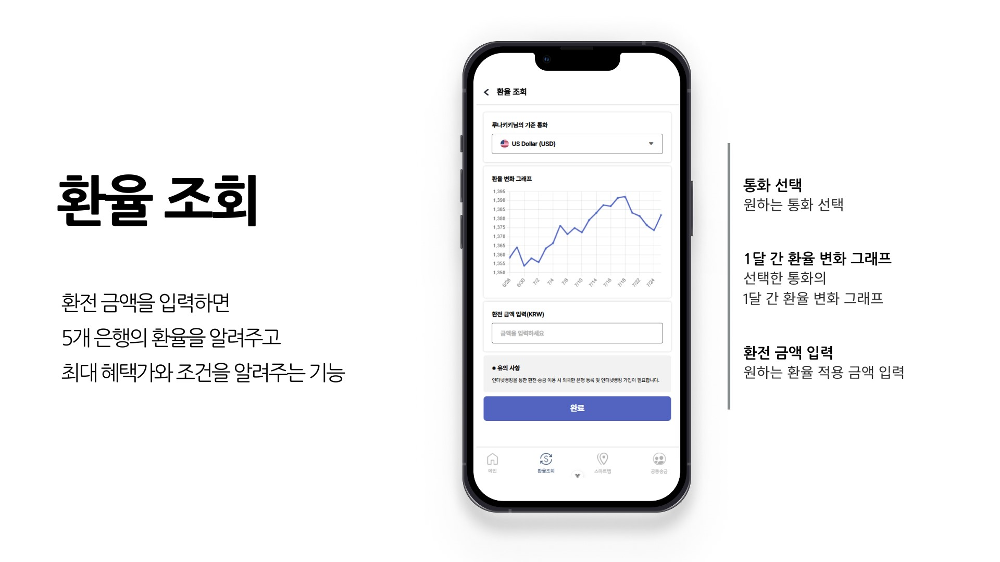
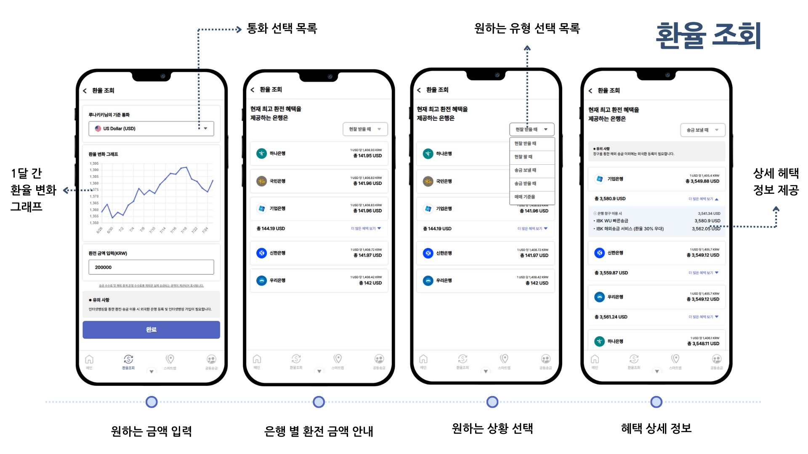
- 입력 금액 기준 5개 은행 환율 비교
- 최적의 혜택가 및 조건 제공
- 1개월 환율 변동 그래프 확인 가능

---

### 🗺️스마트맵
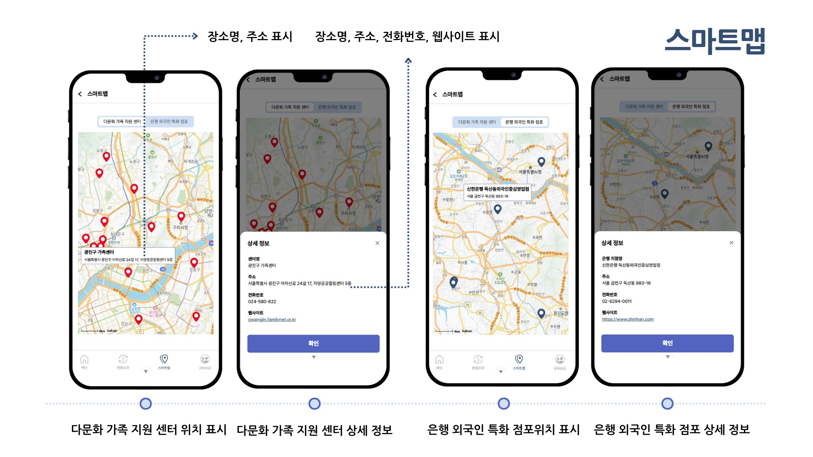
- 다문화가족지원센터 & 외국인 특화 은행 지점 표시
- 사용자 위치 기반 가까운 순서로 안내
- 마커 클릭 -> 상세 정보 모달 확인 가능
  - 빨간 마커 : 다문화 가족 지원 센터 위치
  - 파란 마커 : 은행 외국은 특화 점포 위치

## 📐 ERD

## 🏗 시스템 아키텍처
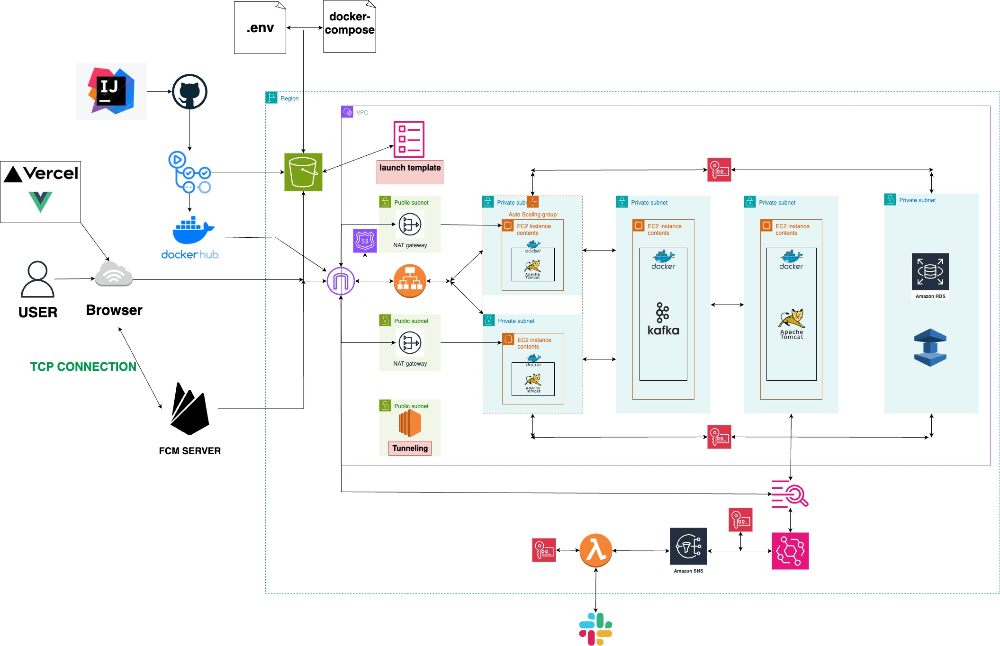
