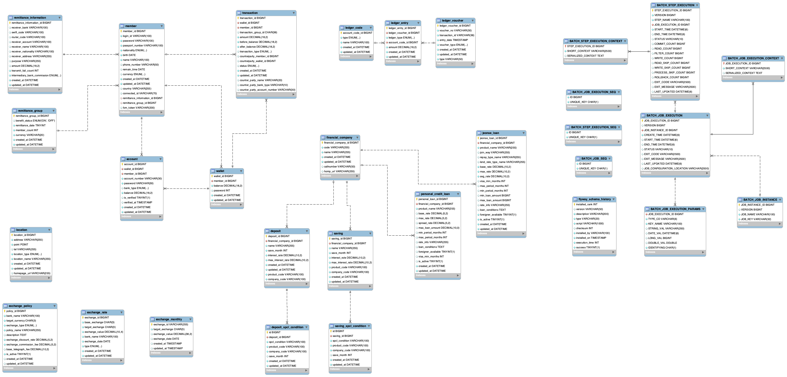

## 📝 목차 (Table of Contents)

- [1. 프로젝트 소개](#1-프로젝트-소개-)
- [2. 팀원 구성](#2-팀원-구성)
- [3. 개발 기간](#3-개발-기간)
- [4. 기술 스택 🚀](#4-기술-스택-)
- [5. 주요 기능 (Features)](#5-주요-기능-features)
- [6. ERD](#6-erd)

---

## 1. 프로젝트 소개 📄
“외국인 전자 지갑 서비스”
 
외국인 유학생, 근로자, 다문화가정’을 대상으로,
언어·금융 소외 해소를 위한 디지털 금융 플랫폼

 

## 2. 팀원 구성
|               이준범(팀장)               |                 최예빈                 | 박준아 | 김호진 | 유예원 |
|:-----------------------------------:|:-----------------------------------:| :---: | :---: | :---: |
|  |  |  |  |  |
|            PM & Back End            |        Front End & Docs Lead        | Back End & git | Back End | Front End & UI/UX |

## 3. 개발 기간

 

## 4. 기술 스택 🚀
프론트 vue
 
백엔드 spring

 

## 5. 주요 기능 (Features)
여기에 주요 기능 내용을 작성합니다.

 

## 6. erd

